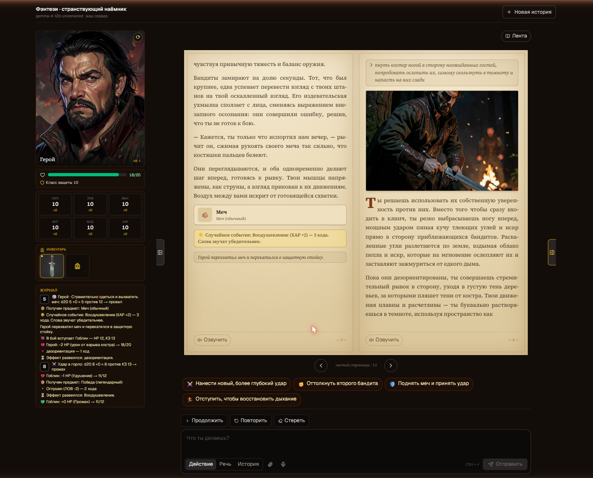

<div align="center">

# Dungeon Ultimate

**Офлайн AI-данжен-мастер с настоящими 3D-кубиками, полноценной D&D-механикой, расцензуренной генерацией картинок на твоём GPU и голосовым вводом — твои приключения не покидают твой компьютер.**

[](LICENSE)
[](https://github.com/timoncool/dungeon-ultimate/stargazers)
[](https://github.com/timoncool/dungeon-ultimate/network/members)
[](https://github.com/timoncool/dungeon-ultimate/commits)
[](https://github.com/timoncool/dungeon-ultimate/issues)
[](https://nextjs.org/)
[](#чем-отличается)

**[English](README.md)** · **[Русский](README_RU.md)**



</div>

## О проекте

**Dungeon Ultimate** — полностью локальный AI-движок для ролевых игр: неутомимый данжен-мастер, который пишет твою историю, ведёт настоящие настольные правила, бросает физические кубики, иллюстрирует сцену и читает её вслух. Всё это происходит на твоей видеокарте NVIDIA: без облака, без API-ключей, без аккаунтов, без цензуры — и ничего никогда не уходит с ПК.

Это сильно расширенный форк [open-dungeon](https://github.com/newideas99/open-dungeon), перестроенный вокруг локальной текстовой модели, расцензуренного локального пайплайна картинок FLUX, игрового движка в духе D&D с **настоящими 3D-кубиками на физике** и голосового ввода на устройстве. Запусти лаунчеры и играй на `http://localhost:3000`.

## Чем отличается

Большинство «AI-данженов» — это тонкая обёртка над чужой облачной LLM: твои промпты логируются, модель зацензурена, а за текстом нет никакой реальной игровой механики. Dungeon Ultimate переворачивает всё это:

- **Работает на твоём железе.** Модель историй, модель картинок и модель речи грузятся на твой GPU. Выдерни сетевой кабель — всё продолжит работать.
- **Есть настоящие правила.** Детерминированный движок D&D 5e разрешает проверки, бой и урон через серверный CSPRNG — рассказчик объявляет действие, а исход решает движок, так что ИИ не может смухлевать.
- **Кубики настоящие.** Настоящий d20 на физике катится по сцене (three.js + cannon-es) и принудительно ложится ровно на то число, которое движок уже выбросил.
- **Без цензуры.** Локальная нефильтрованная текстовая модель плюс локальный пайплайн FLUX — с опциональным abliterated текст-энкодером для картинок — дают ничем не ограниченное взрослое повествование и арт, целиком на твоё усмотрение и полностью приватно.

## Возможности

### Настоящие 3D-кубики на физике
- Настоящий d20 на [`@3d-dice/dice-box-threejs`](https://github.com/3d-dice/dice-box-threejs) (three.js + cannon-es) катится по сцене с реальной физикой.
- Броски **честные** — детерминированный движок сначала бросает через Node `crypto` CSPRNG, а затем экранный кубик принудительно (`1d20@N`) ложится ровно на это значение. Никаких подкруток и перебросов.
- Осевший кубик подсвечивается по исходу (золотой — крит, красный — провал) и записывается в журнал приключений.

### Игровой режим D&D
- **Лист персонажа** — шесть характеристик D&D 5e (Сила / Ловкость / Выносливость / Интеллект / Мудрость / Харизма), AC, уровень, опыт и состояния.
- **Проверки d20** — рассказчик объявляет проверку (характеристика + DC); движок бросает `d20 + модификатор`, при этом натуральная 20 всегда крит-успех, а натуральная 1 всегда провал.
- **HP и смерть** — у персонажей считаются текущие/макс. HP, и при нуле они переходят в состояние «мёртв».
- **Пошаговый бой** — рассказчик может выводить врагов, разрешать броски атаки против AC и наносить урон; противники отслеживаются в рамках стычки.
- **Журнал приключений** — каждый бросок, попадание, дроп и смерть дописываются в журнал для игрока, который заодно служит аудит-логом движка.
- **Дроп лута** — враги и сундуки выдают предметы инвентаря со слотами, уровнями редкости и модификаторами характеристик; каждый дроп можно проиллюстрировать, а портрет переиспользовать через image2image.
- Игровой режим на каждый чат и **включён по умолчанию** — оставь его для полноценной RPG-сессии или выключи для свободного повествования.

### Расцензуренная генерация картинок на устройстве
- Сцены иллюстрируются **локально** квантизованным пайплайном **FLUX.2-klein-4B** — без облака, без ключа, без фильтра.
- Рассказчик вызывает инструмент картинок прямо по ходу истории, и изображение рендерится внутри повествования.
- Из коробки работает на негейтнутых весах FLUX.2-klein SDNQ (без токена, без фильтра); опциональный **abliterated текст-энкодер** (по желанию, гейтнутый) снимает последний контентный фильтр для ничем не ограниченного арта 18+.
- Анимация Ken-Burns на готовых картинках и повтор генерации в один клик.

### Голосовой ввод
- Проговаривай действие вместо набора — кнопка микрофона записывает звук и расшифровывает его на устройстве.
- Работает на ASR **NVIDIA Parakeet-TDT-0.6B-v3** (через `onnx-asr` + ONNX Runtime GPU), локально и без загрузки в сеть.

### И всё остальное
- **Потоковый вывод** — текст рассказчика появляется в чате слово за словом.
- **Озвучка (TTS)** — ходы могут читаться вслух локальным сервером синтеза речи.
- **Одна модель на GPU за раз** — текстовая LLM выгружается на время рендера картинки и грузится обратно на следующем ходе, так что каждой достаётся вся видеопамять.
- **Редактируемые промпты и настройки на чат** — промпт рассказчика, промпт картинок, мир, стиль, персонажи, длина ответа, голос.
- **7 языков игры** — рассказчик, кнопки-действия, подсказки и озвучка следуют выбранному языку (русский, английский, испанский, французский, немецкий, китайский, японский), переключается прямо в приложении. Интерфейс — на русском; промпты картинок остаются на английском для FLUX.
- **Портативные Windows-лаунчеры** — `install.bat` / `run.bat` / `stop.bat`; модели, рантаймы и кэш живут на несистемном диске.

## Требования

- **ОС:** Windows 10/11 (`install.bat` + `run.bat` ставят полностью портативную, самодостаточную сборку)
- **GPU:** NVIDIA, 12+ ГБ VRAM (RTX 40xx/50xx полностью поддержаны; 20xx/30xx/Pascal выбираются в установщике). Установщик ставит подходящие CUDA-колёса (cu126 / cu128) под твой GPU.
- **Node.js:** в комплекте — `install.bat` скачивает портативный Node 22 в папку проекта
- **Python:** в комплекте — `install.bat` создаёт два встроенных окружения Python 3.11 (текст/TTS и картинки)
- **Диск:** ~30+ ГБ под встроенные рантаймы плюс веса моделей
- **Веса моделей — всё качается само, ничего предоставлять руками не нужно.** `install.bat` клонирует (публичный) image-бэкенд — движок Qwen3-TTS встроен прямо в репо в `servers/tts_engine.py`, ничего приватного клонировать не нужно — и скачивает голосовой пак в `servers/voices/`; при первом старте все модели тянутся с Hugging Face — Gemma 4 12B GGUF (текст), веса картинок FLUX.2-klein SDNQ, голосовая модель Qwen3-TTS, модель ASR Parakeet. Всё это негейтнутое. Полностью abliterated текст-энкодер FLUX лежит в **гейтнутом** HF-репо, поэтому остаётся опциональным: укажи `IMAGE_SERVER_DEFAULT_BACKEND=flux-uncensored`, когда получишь доступ к репо и HF-токен. Можешь также положить свои `.mp3`-клипы в `servers/voices/`.

> Приложение спроектировано самодостаточным: временные файлы, кэши Hugging Face, кэши Torch и хранилища моделей перенаправлены на диск проекта — ничего не пишется в `C:` или реестр.

## Быстрый старт

1. **Клонировать**
   ```bash
   git clone https://github.com/timoncool/dungeon-ultimate.git
   cd dungeon-ultimate
   ```

2. **Установить** — запусти `install.bat`, выбери свой GPU и дай ему скачать портативные Node + Python, поставить зависимости и собрать веб-приложение.
   ```
   install.bat
   ```

3. **Запустить** — поднимает серверы текста, картинок, TTS и веба вместе.
   ```
   run.bat
   ```
   Браузер откроется на `http://localhost:3000`. Остановить всё — `stop.bat`.

## Как играть

- Создай чат, задай мир/стиль или выбери персонажа, затем введи **или произнеси** действие — рассказчик потоком выдаёт ход истории.
- Включи **игровой режим** для полноценной D&D-сессии: проверки характеристик бросают настоящий 3D-кубик, бой разрешается против AC, HP и лут отслеживаются, а каждый результат попадает в журнал приключений.
- Нажми кнопку **микрофона**, чтобы продиктовать действие; оно расшифровывается локально через Parakeet.
- Включи **озвучку**, чтобы ходы читались вслух.
- Правь промпты рассказчика / картинок в боковых панелях, чтобы настроить тон и арт-дирекшн.

## Другие портативные нейросети — [timoncool](https://github.com/timoncool)

| Проект | Описание |
|--------|----------|
| [ACE-Step Studio](https://github.com/timoncool/ACE-Step-Studio) | AI-студия музыки — песни, вокал, каверы, клипы |
| [VideoSOS](https://github.com/timoncool/videosos) | AI-видеопродакшн в браузере |
| [Foundation Music Lab](https://github.com/timoncool/Foundation-Music-Lab) | Генерация музыки + таймлайн-редактор |
| [Qwen3-TTS](https://github.com/timoncool/Qwen3-TTS_portable_rus) | Синтез речи с клонированием голоса |
| [SuperCaption Qwen3-VL](https://github.com/timoncool/SuperCaption_Qwen3-VL) | Генерация описаний изображений |
| [civitai-mcp-ultimate](https://github.com/timoncool/civitai-mcp-ultimate) | Civitai API как MCP-сервер |
| [ScreenSavy](https://github.com/timoncool/ScreenSavy.com) | Генератор эмбиент-экранов |

## Авторы

- **Nerual Dreming** — [Telegram](https://t.me/nerual_dreming) | [neuro-cartel.com](https://neuro-cartel.com) | [ArtGeneration.me](https://artgeneration.me)
- **Нейро-Софт** — [Telegram](https://t.me/neuroport) | портативные нейросети

## Благодарности

Сделано на основе [**open-dungeon**](https://github.com/newideas99/open-dungeon) от [@newideas99](https://github.com/newideas99) — оригинального локального AI-приложения для ролёвок, которое этот форк расширяет. Огромное спасибо за фундамент.

3D-кубики работают на [@3d-dice/dice-box-threejs](https://github.com/3d-dice/dice-box-threejs). Распознавание речи — NVIDIA [Parakeet-TDT-0.6B](https://huggingface.co/nvidia/parakeet-tdt-0.6b-v3) через [onnx-asr](https://github.com/istupakov/onnx-asr). Картинки — [FLUX.2](https://github.com/black-forest-labs/flux).

## Поддержать автора

Я создаю опенсорс софт и занимаюсь исследованиями в области ИИ. Большая часть всего, что я делаю, находится в открытом доступе. Ваши пожертвования позволяют мне создавать и исследовать больше, не отвлекаясь на поиск еды для продолжения существования =)

**[Все способы поддержки](https://github.com/timoncool/ACE-Step-Studio/blob/master/DONATE.md)** | **[dalink.to/nerual_dreming](https://dalink.to/nerual_dreming)** | **[boosty.to/neuro_art](https://boosty.to/neuro_art)**

- **BTC:** `1E7dHL22RpyhJGVpcvKdbyZgksSYkYeEBC`
- **ETH (ERC20):** `0xb5db65adf478983186d4897ba92fe2c25c594a0c`
- **USDT (TRC20):** `TQST9Lp2TjK6FiVkn4fwfGUee7NmkxEE7C`

## Star History

<a href="https://www.star-history.com/?repos=timoncool%2Fdungeon-ultimate&type=date&legend=top-left">
 <picture>
   <source media="(prefers-color-scheme: dark)" srcset="https://api.star-history.com/image?repos=timoncool/dungeon-ultimate&type=date&theme=dark&legend=top-left" />
   <source media="(prefers-color-scheme: light)" srcset="https://api.star-history.com/image?repos=timoncool/dungeon-ultimate&type=date&legend=top-left" />
   
 </picture>
</a>

## Лицензия

[MIT](LICENSE) — как и у upstream-проекта. Делай что хочешь; ссылка на авторство приветствуется.
