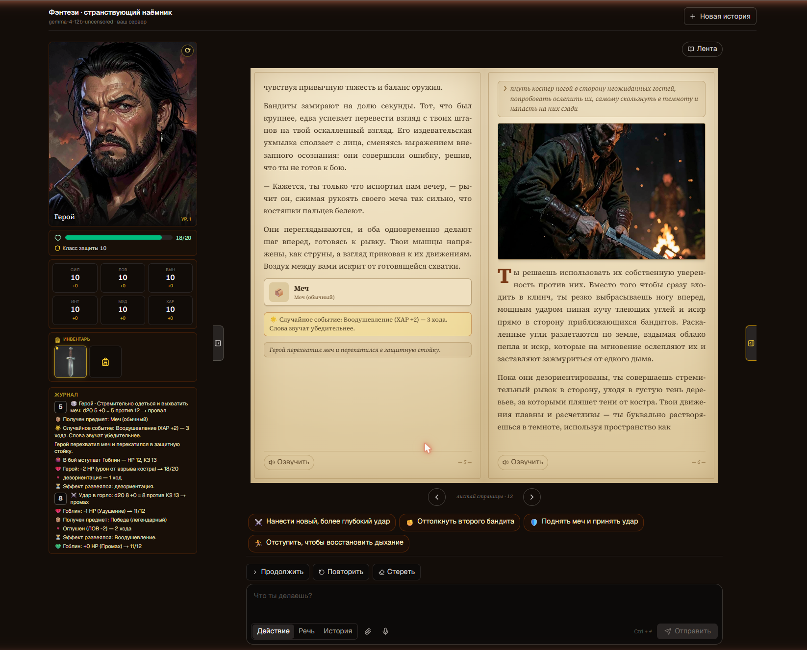
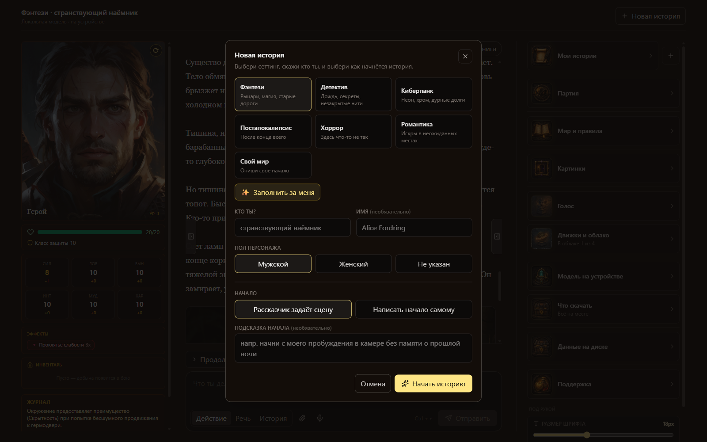
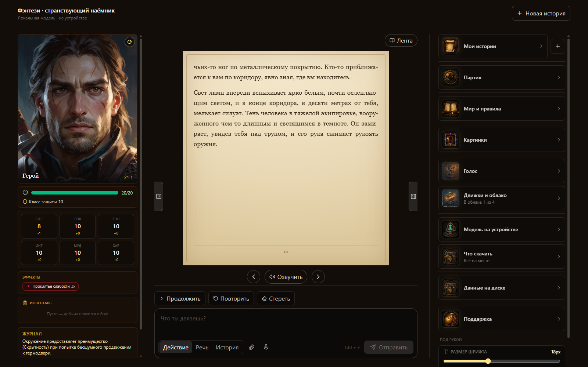
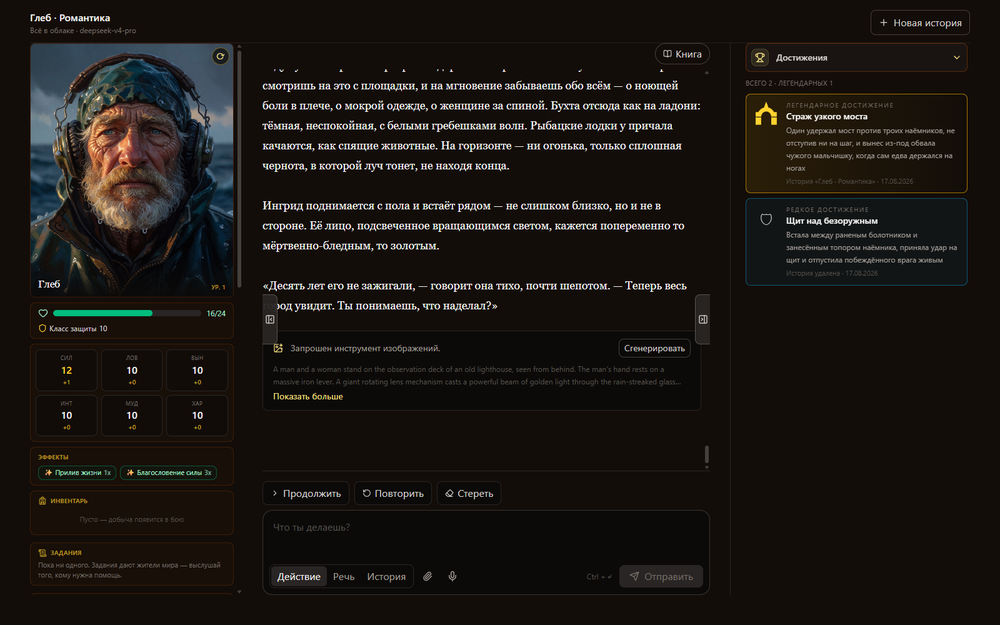
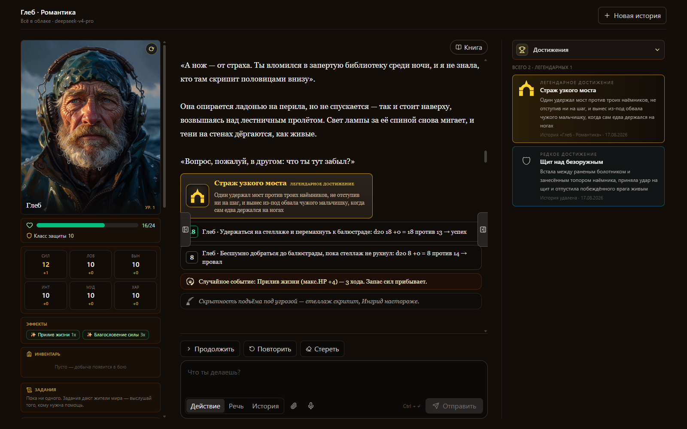
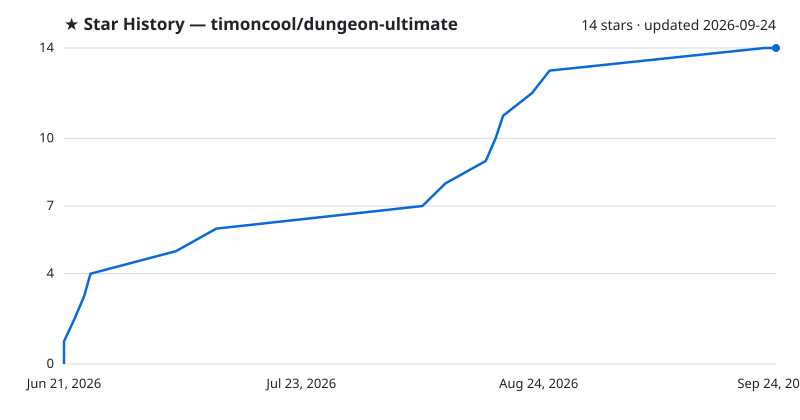

# Dungeon Ultimate

**Оффлайновый ИИ-мастер подземелий: настоящий трёхмерный кубик, полноценные правила D&D, картинки без цензуры прямо на твоей карте и голосовой ввод. Приключения не покидают твою машину.**

**[English](README.md)** · **[Русский](README_RU.md)** · **[Сайт](https://timoncool.github.io/dungeon-ultimate/)**

## Что это

**Dungeon Ultimate** — движок ролевой игры, который целиком работает на твоём компьютере. Неутомимый мастер подземелий пишет историю, ведёт настоящие настольные правила, бросает физический кубик, рисует сцену и читает её вслух. Всё может считать твоя видеокарта: без учёток, без фильтров, и наружу ничего не уходит. Облачный режим есть, если он нужен: любую стадию хода можно увести в OpenRouter, и тогда та же игра пойдёт на машине без видеокарты.

Это сильно переработанный форк [open-dungeon](https://github.com/newideas99/open-dungeon): локальная текстовая модель, нецензурированная генерация картинок, игровой движок по правилам D&D с **настоящим трёхмерным кубиком** и голосовой ввод.

**С версии 0.2 приложение — один бинарь на Rust.** Прежняя сборка требовала Next.js и четырёх питоновских серверов; теперь один исполняемый файл отдаёт интерфейс, ведёт ход и работает со всеми движками напрямую. Ни Python, ни Node при запуске не нужны, в систему ничего не ставится: удалил папку — удалил игру.

## Чем отличается

- **Считает твоё железо.** Текстовая модель, модель картинок и озвучка грузятся на твою карту. Выдерни сетевой кабель — игра продолжится.
- **Правила настоящие.** Детерминированный движок D&D 5e разрешает проверки, бой и урон криптостойким генератором: рассказчик объявляет действие, исход решает движок, поэтому нейросеть не может смухлевать.
- **Кубик настоящий.** По сцене катится физический двадцатигранник (three.js + cannon-es), и ему задано лечь ровно тем числом, которое движок уже выбросил.
- **Без цензуры.** Локальная нефильтрованная текстовая модель и локальные картинки с абляционным энкодером: взрослые истории и рисунки — твоё дело и только твоё.
- **Работает и вовсе без видеокарты.** Любую стадию хода — прозу, кадр, озвучку, распознавание речи — можно по отдельности увести в облако, и на ноутбуке пойдёт та же игра.

## Возможности

### Настоящий трёхмерный кубик
- Двадцатигранник на [`@3d-dice/dice-box-threejs`](https://github.com/3d-dice/dice-box-threejs) (three.js + cannon-es) катится по сцене с настоящей физикой.
- Броски **честные**: сначала бросает движок криптостойким генератором, затем экранному кубику задают лечь именно этим числом (`1d20@N`). Ни подкруток, ни перебросов.
- Улёгшийся кубик подсвечивается по исходу (золотой крит, красный провал) и попадает в журнал приключения.

### Режим D&D
- **Лист персонажа** — шесть характеристик D&D 5e (СИЛ / ЛОВ / ВЫН / ИНТ / МУД / ХАР), класс защиты, уровень, опыт и состояния.
- **Проверки d20** — рассказчик объявляет проверку (характеристика и сложность), движок бросает `d20 + модификатор`; натуральные 20 и 1 всегда крит и провал.
- **Здоровье и смерть** — у персонажей есть текущее и максимальное здоровье, на нуле они падают; лечение выше нуля возвращает в строй.
- **Пошаговый бой** — рассказчик вводит врагов, атаки бросаются против класса защиты, крит удваивает кости (а не плоскую прибавку), противники живут в рамках стычки.
- **Журнал приключения** — каждый бросок, попадание, находка и смерть попадают в понятный игроку журнал, **на языке твоей игры**.
- **Добыча** — враги и сундуки дают предметы со слотами, редкостью и модификаторами; каждую вещь можно нарисовать, и её портрет потом служит референсом.
- **Случайные события** — между ходами настигают благословения и проклятия с настоящими модификаторами на срок.
- Режим включён по умолчанию и настраивается для каждой истории отдельно.

### У рассказчика есть инструменты
- Модель не гадает о состоянии игры — она **спрашивает**: открытые задания, лист персонажа, инвентарь, журнал, память о местах, где уже бывали.
- И действует через тот же слой: бросает проверку и узнаёт исход **посреди фразы**, закрывает выполненное задание, заводит нового говорящего, чтобы у него был свой голос, заказывает кадр к сцене, вручает достижение.
- Правило прежнее: **модель предлагает, движок решает**. Инструмент проверяет намерение — закрыть можно только взятое задание, кубик кидает только движок — и отвечает словами, когда модель промахнулась, чтобы она поправилась в том же ходу.
- Работает и в облаке, и на своей Гемме.

### Задания и достижения
- **Задания** — редкое и заметное событие: живой человек просит о помощи, а брать или нет, решаешь ты. Взятое висит в левой колонке, пока не закроется, и рассказчик закрывает его, когда условие действительно выполнено.
- **Опыт и уровни** — за выполненное задание платят опытом, герой растёт.
- **Достижения** — награда за поступок: выстоял против сильнейшего, пощадил побеждённого, прошёл сцену без единого удара. Живут в **профиле игрока**, а не внутри истории: удалишь историю — награда останется и будет помнить, где заслужена. У каждой значок из пака [game-icons.net](https://github.com/game-icons/icons), редкость и повод.

### Картинки на своей карте, без цензуры
- Сцены рисует **Krea-2 Turbo** (GGUF Q4_K_M) на [stable-diffusion.cpp](https://github.com/leejet/stable-diffusion.cpp) — одна универсальная модель и для генерации, и для правки кадра.
- Текстовый энкодер — **абляционный Qwen3-VL-4B**, между тобой и картинкой нет ни одного фильтра.
- **Непрерывность сцены** — у места есть опорный кадр, следующие снимки делаются его правкой, поэтому комната остаётся той же комнатой. Через несколько правок сцена переустанавливается, чтобы не накапливался дрейф.
- Портреты героя и предметов тоже рисуются и переиспользуются как референсы.
- Медленный наезд на готовом кадре и перерисовка одной кнопкой.

### Голос
- **Озвучка** — ход читает **Higgs Audio v3** с клонированием голоса; пак голосов идёт в комплекте, свой эталон можно добавить.
- **Потоковая речь** — фразы синтезируются, пока рассказчик ещё пишет, поэтому звук начинается через секунды, а не после конца хода.
- **Голоса персонажей** — реплики в кавычках читаются голосом того, кто их произнёс.
- **Голосовой ввод** — скажи своё действие, его распознает **NVIDIA Parakeet-TDT-0.6B-v3** прямо на устройстве.
- **Слух на выбор** — **NVIDIA Parakeet-TDT-0.6B-v3** или **Whisper**; второй качается, только если его выбрать.
- **В облаке фразы синтезируются одновременно** — до четырёх разом, играются строго по порядку, поэтому звук поспевает за прозой, а не тянется следом.

### Облако (по желанию)
- Каждая стадия — рассказчик, кадр, озвучка, распознавание — переключается между «на моей карте» и «в облаке» независимо, через [OpenRouter](https://openrouter.ai).
- Списки моделей тянутся живьём: 400+ текстовых, 40+ рисующих, 18 озвучки, 19 распознавания. Голоса подписаны полом и тем, тянут ли они русскую речь.
- Когда все стадии в облаке, видеокарта не нужна вовсе.

### И остальное
- **Потоковый текст** — проза рассказчика приходит в чат по словам.
- **Режим книги** — история читается разворотами, с картинками на своих местах.
- **На карте одна модель за раз** — общая очередь делит карту между текстом, картинкой и озвучкой, чтобы каждому досталась вся. Озвучка идёт параллельно кадру, когда хватает памяти.
- **Монитор ресурсов** — плавающий виджет показывает загрузку карты, память, питание и оперативку прямо во время хода.
- **Правятся все промпты и настройки** — промпт рассказчика, промпт картинок, мир, стиль, персонажи, длина ответа, голоса, размер контекста, число шагов и прочее.
- **7 языков игры** — рассказ, чипсы действий, подсказки, журнал и речь идут на выбранном языке (русский, английский, испанский, французский, немецкий, китайский, японский). Промпт картинки остаётся английским: его читает модель.
- **Один установщик, одно окно** — `.exe` и настольное приложение: ни скриптов, ни консоли, ни вкладки браузера. Новые версии подписаны и приезжают встроенным обновлением.

## Что нужно

- **Система:** Windows 10/11.
- **Видеокарта:** NVIDIA от 12 ГБ памяти для полностью локальной игры (на 24 ГБ озвучка и кадр считаются параллельно). **Без карты тоже можно** — играй в облачном режиме.
- **Для установки:** ничего. Rust и Node нужны, только если собираешь из исходников.
- **Диск:** ~17.4 ГБ под обязательные модели, ~23 ГБ вместе с озвучкой и распознаванием.
- **Веса игра качает сама.** Ничего искать руками не нужно: ни токенов, ни закрытых репозиториев. На первом запуске открывается раздел **«Что скачать»** со списком, размерами и пояснением, зачем каждый компонент. Прерванная загрузка продолжается с места обрыва.

> Всё живёт внутри папки игры: модели, сохранения, кадры, временные файлы. На диск `C:` и в реестр не пишется ничего.

## Быстрый старт

1. **Скачай установщик** — [`DungeonUltimate-x64-setup.exe`](https://github.com/timoncool/dungeon-ultimate/releases/latest) из последнего релиза. Один файл, около 16 МБ. Ничего собирать не нужно.

2. **Запусти его.** Игра ставится в твою пользовательскую папку и открывает своё окно — ни консоли, ни вкладки браузера, ни скриптов.

3. **На первом запуске** открой **«Что скачать»** и дай игре добрать модели. У каждого куска написан размер и зачем он; прерванная загрузка продолжается с места обрыва.

4. **Обновления приходят сами.** Игра сообщит о новой версии и поставит её с твоего согласия. Сохранения, модели и настройки остаются на месте.

> Собрать из исходников по-прежнему можно: нужны [Rust](https://rustup.rs) и [Node.js](https://nodejs.org), дальше `cargo tauri build` в `desktop/`.

## Как играть

<table>
<tr>
<td width="50%" valign="top"> <b>Начни историю</b> — выбери жанр, скажи, кто ты, и рассказчик напишет завязку.</td>
<td width="50%" valign="top"> <b>Чистое повествование</b> — проза приходит по словам, как в книге.</td>
</tr>
<tr>
<td width="50%" valign="top"> <b>Достижения и инструменты</b> — рассказчик спрашивает движок о состоянии игры, кидает проверки посреди фразы и вручает награды, которые живут в профиле.</td>
<td width="50%" valign="top"> <b>Ход целиком</b> — бросок, значки событий в журнале и кадр к сцене.</td>
</tr>
</table>

- Создай историю, выбери сеттинг и скажи, кто ты, — лист персонажа и портрет героя сделаются сами.
- Напиши **или скажи** действие: рассказчик пишет ход, движок разрешает механику, катится кубик, рисуется кадр, отрывок читается вслух.
- Выключи режим игры, если хочешь чистое повествование без правил.
- Переключи любую стадию в облако в разделе **«Движки и облако»**, если карта занята — или если карты нет.

## Как устроено

| Слой | Что это |
|---|---|
| Сервер | Rust + axum, один бинарь; отдаёт интерфейс с того же адреса и ведёт ход |
| Интерфейс | React + Vite + Tailwind, собирается в статику рядом с бинарём |
| Ход | несколько проходов: проза → механика → заявка на кадр → чипсы действий, каждый по своей схеме |
| Правила | детерминированный движок D&D 5e в отдельном крейте, криптостойкие броски, 200+ тестов |
| Текст | сайдкар llama.cpp (Gemma 4 12B без цензуры, Q4_K_M) |
| Картинки | stable-diffusion.cpp через FFI (Krea-2 Turbo Q4_K_M, абляционный энкодер Qwen3-VL, VAE Wan 2.1) |
| Речь наружу | Higgs Audio v3 через родной движок, потоком по фразам |
| Речь внутрь | Parakeet-TDT-0.6B-v3 через ONNX Runtime |
| Облако | OpenRouter, отдельно на каждую стадию, со свежими списками моделей и голосов |
| Хранилище | SQLite; сохранения прежней версии открываются без изменений |

## Другие проекты [timoncool](https://github.com/timoncool)

| Проект | Описание |
|---------|-------------|
| [Dub Studio](https://github.com/timoncool/dub-studio) | Студия ИИ-дубляжа: расшифровка, перевод, озвучка, сведение |
| [ACE-Step Studio](https://github.com/timoncool/ACE-Step-Studio) | ИИ-студия музыки: песни, вокал, каверы, клипы |
| [VideoSOS](https://github.com/timoncool/videosos) | Производство видео с ИИ прямо в браузере |
| [Foundation Music Lab](https://github.com/timoncool/Foundation-Music-Lab) | Генерация музыки и таймлайн-редактор |
| [Qwen3-TTS](https://github.com/timoncool/Qwen3-TTS_portable_rus) | Портативный синтез речи с клонированием голоса |
| [SuperCaption Qwen3-VL](https://github.com/timoncool/SuperCaption_Qwen3-VL) | Портативное описание картинок |
| [civitai-mcp-ultimate](https://github.com/timoncool/civitai-mcp-ultimate) | Civitai API как MCP-сервер |
| [ScreenSavy](https://github.com/timoncool/ScreenSavy.com) | Генератор фоновых экранов |

## Авторы

- **Nerual Dreming** — [Telegram](https://t.me/nerual_dreming) | [neuro-cartel.com](https://neuro-cartel.com) | [ArtGeneration.me](https://artgeneration.me)
- **Нейро-Софт** — [Telegram](https://t.me/neuroport) | портативные нейросетевые приложения

## Благодарности

Сделано на основе [**open-dungeon**](https://github.com/newideas99/open-dungeon) от [@newideas99](https://github.com/newideas99) — это оригинальное локальное ролевое приложение, которое расширяет форк. Огромное спасибо за фундамент.

Кубик работает на [@3d-dice/dice-box-threejs](https://github.com/3d-dice/dice-box-threejs). Картинки — [stable-diffusion.cpp](https://github.com/leejet/stable-diffusion.cpp) от [@leejet](https://github.com/leejet) с весами [Krea-2](https://huggingface.co/realrebelai/KREA-2_GGUFs). Текст — [llama.cpp](https://github.com/ggml-org/llama.cpp). Распознавание речи — [Parakeet-TDT-0.6B](https://huggingface.co/nvidia/parakeet-tdt-0.6b-v3) от NVIDIA; озвучка — [Higgs Audio v3](https://huggingface.co/drbaph/Higgs-Audio-v3-Studio).

## Поддержать автора

Я делаю открытый софт и занимаюсь исследованиями в ИИ. Почти всё, что получается, бесплатно и доступно всем. Донаты помогают делать это дальше и не думать, откуда возьмётся следующий обед =)

**[Все способы доната](DONATE.md)** | **[dalink.to/nerual_dreming](https://dalink.to/nerual_dreming)** | **[boosty.to/neuro_art](https://boosty.to/neuro_art)**

- **BTC:** `1E7dHL22RpyhJGVpcvKdbyZgksSYkYeEBC`
- **ETH (ERC20):** `0xb5db65adf478983186d4897ba92fe2c25c594a0c`
- **USDT (TRC20):** `TQST9Lp2TjK6FiVkn4fwfGUee7NmkxEE7C`

## История звёзд

<a href="https://github.com/timoncool/dungeon-ultimate/stargazers">
 <picture>
   <source media="(prefers-color-scheme: dark)" srcset="docs/stars-dark.svg" />
   <source media="(prefers-color-scheme: light)" srcset="docs/stars-light.svg" />
   
 </picture>
</a>

## Лицензия

[MIT](LICENSE) — как и у исходного проекта. Делай что хочешь; упоминание автора приветствуется.
